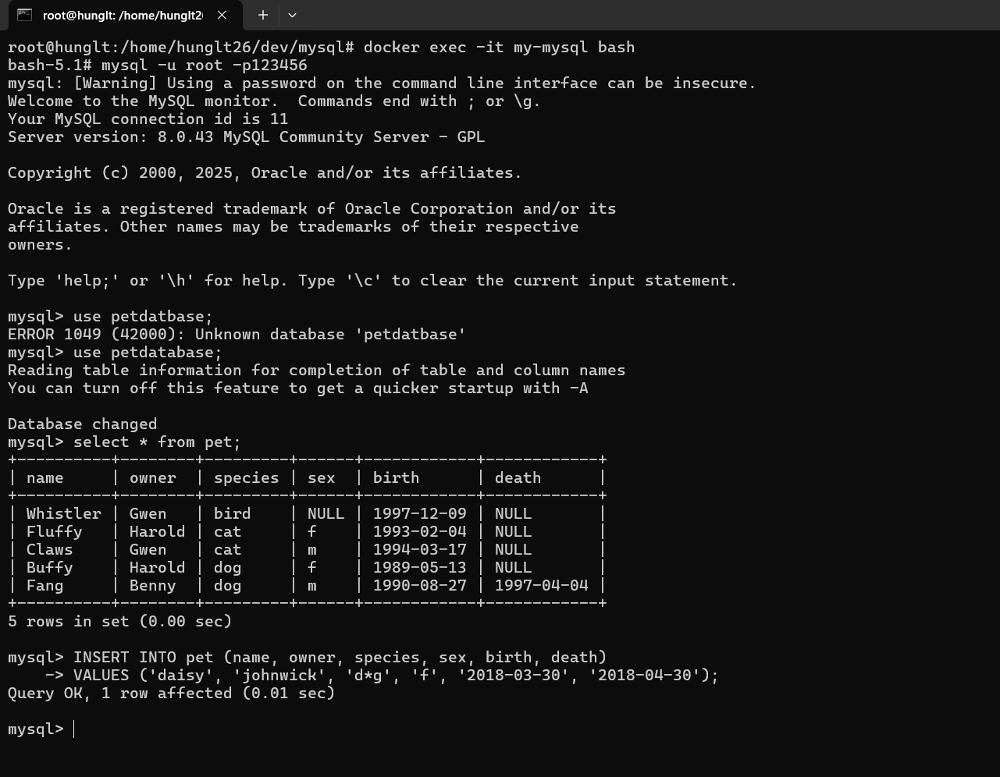
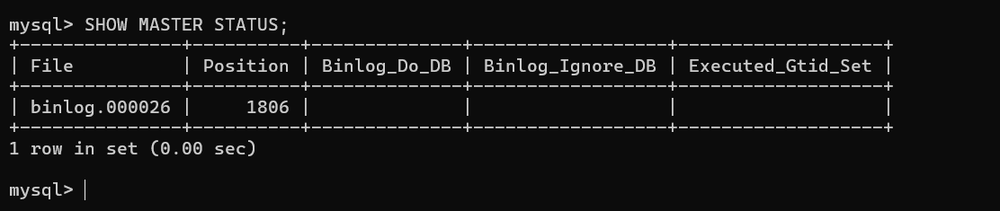
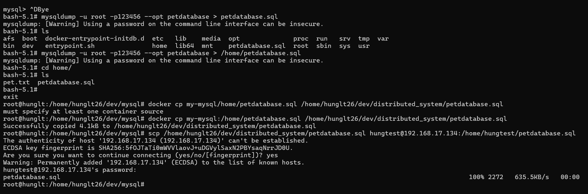
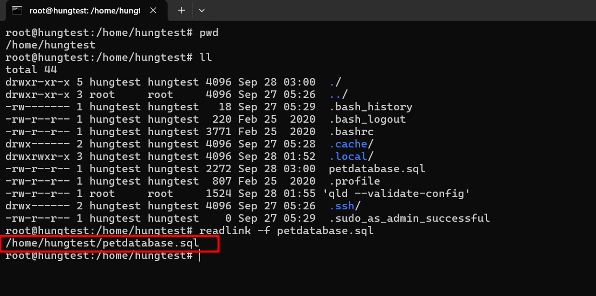

# Chương 5: Tính nhất quán và Sao chép (Replication)

### Câu 1: Kết quả bạn nhìn thấy là gì? Bây giờ, hãy thử thêm một bản ghi khác vào bảng pet bằng cách sử dụng các câu lệnh SQL.

Query bảng Pet thì thấy tất cả các bảng ghi đã insert vào từ file pet.txt.


Để insert thêm bản ghi mới vào bảng Pet ta sử dụng câu query:

```sql 
INSERT INTO pet (name, owner, species, sex, birth, death)
     VALUES ('daisy', 'johnwick', 'd*g', 'f', '2018-03-30', '2018-04-30');
```
### Câu 2: Tên của file log và vị trí là gì?



Tên Filelog: binlog.000026 là file binary log mà MySQL Master đang ghi nhận các thay đổi.
Vị trí: 1806 là vị trí (position) trong file binlog.000026 – nơi các thay đổi đang được ghi lại.

### Câu 3: Bạn đã nhận được file này trên máy Slave chưa? Đường dẫn của file nhận được trên máy Slave là gì?

Mysql master em đã cài trước bằng docker, giờ tận dụng lại nên có thêm một số lệnh khác.



Đường dẫn file petdatabase.sql: /home/hungtest/petdatabase.sql

### Câu 4: Bạn nhận được thông tin trạng thái gì? Làm thế nào để bạn biết cấu hình là OK?


Trạng thái hiển thị Slave_IO_Running: Yes và Slave_SQL_Running: Yes. Không có lỗi trong Last_Error, điều đó cho thấy replication hoạt động bình thường.

### Câu 5: Trên máy Slave, hãy kiểm tra xem dữ liệu mới được chèn có được sao chép (replicate) từ Master sang Slave chưa. Bạn đã sử dụng lệnh nào?


Đầu tiên trên Mysql mater: servername là hunglt (terminal bên trái) và Mysql Slave: servername là hungtest (terminal bên phải) cùng chạy câu query:

```sql
select * from pet;
```
Ta thấy chưa có bản ghi 
INSERT INTO pet VALUES
('Puffball','Diane','hamster','f','1999-03-30',NULL);

Thực hiện câu query insert ở Mysql Master:

```sql
INSERT INTO pet VALUES
('Puffball','Diane','hamster','f','1999-03-30',NULL);
```

Query lại bảng pet trên Mysql Master xác nhận đã insert thành công:
```sql
select * from pet;
```
Sau đó, query lại bảng pet trên Mysql Slave cũng xuất hiện bản ghi mới. Nhưng vậy liệu mới insert có đã được sao chép từ Master sang Slave.


CHANGE MASTER TO MASTER_HOST='192.168.17.133',
MASTER_USER='slave_user', MASTER_PASSWORD='123456',
MASTER_LOG_FILE='binlog.000026', MASTER_LOG_POS= 1806;