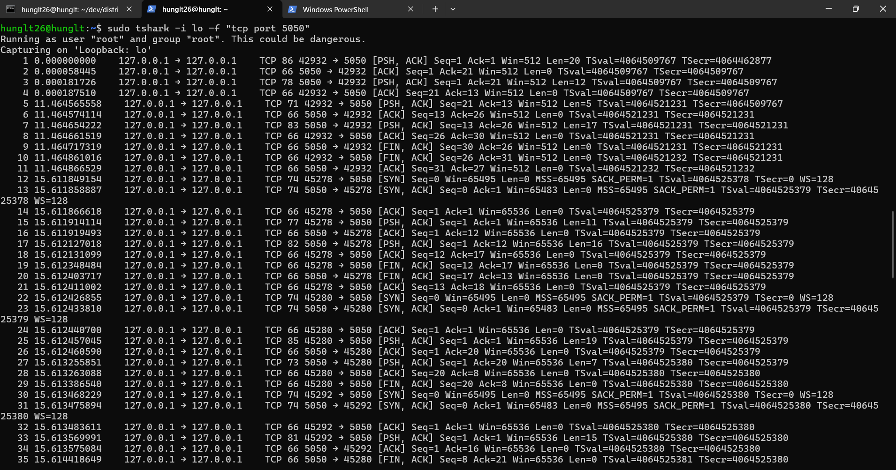

# Phần 1. Interface trong Các hệ thống phân tán

### Câu 1: Interface trong hệ thống phân tán là gì? Tại sao cần phải có Interface khi triển khai các dịch vụ?

a. Interface (giao diện) là tập hợp các quy ước chuẩn (protocols, APIs, message formats…) mà cả phía cung cấp dịch vụ (server) và phía sử dụng dịch vụ (client) phải tuân thủ khi trao đổi dữ liệu trong hệ thống phân tán. 

b. Cần có interface để:
- Tách biệt client và server.
- Dễ mở rộng, thay thế dịch vụ.
- Cho phép các hệ thống khác nhau tương tác.
- Đảm bảo giao tiếp thống nhất, dễ debug.
- Interface trong hệ thống phân tán là gì? 

### Câu 2: Hãy giải thích ý nghĩa của mã trạng thái 201 CREATED, 204 NO_CONTENT và 404 NOT_FOUND trong giao thức KVSS.

- 201 CREATED: Khi client gửi lệnh PUT key value với một key chưa tồn tại trong store, hệ thống sẽ tạo mới một cặp key-value và trả về trạng thái này.

- 204 NO_CONTENT: Khi client gửi lệnh DEL key tồn tại trong dictionary hệ thống xóa key đó thành công, và không còn dữ liệu nào để trả về.

- 404 NOT_FOUND: Khi client gửi lệnh GET key hoặc DEL key nhưng key đó không có trong dictionary. Hệ thống trả về trạng thái này

### Câu 3: Trong bài lab KVSS, nếu client không tuân thủ quy ước Interface (ví dụ: thiếu version KV/1.0), server sẽ phản hồi thế nào? Tại sao phải quy định rõ ràng tình huống này? 

Server phản hồi: 426 UPGRADE_REQUIRED 

Quy định rõ tình huống 426 UPGRADE_REQUIRED là để:

1. Bảo vệ server khỏi request sai chuẩn.
2. Báo cho client biết cách sửa lỗi (gửi đúng format KV/1.0 ...).
3. Đặt nền móng cho việc nâng cấp giao thức trong tương lai.

### Câu 4: Quan sát một phiên làm việc qua Wireshark: hãy mô tả cách mà gói tin TCP được chia để truyền thông điệp theo “line-based protocol”.

Trong phiên TCP này:

Client gửi request (một dòng kết thúc bằng \n) trong payload TCP.

Server ACK rồi gửi response (cũng 1 dòng \n).

TCP chỉ chia dữ liệu thành segment, ứng dụng mới dựa vào dấu xuống dòng để tách thông điệp.

Đặc trưng của line-based protocol: thông điệp = 1 dòng văn bản, còn TCP lo việc vận chuyển gói.

### Câu 5: Giả sử có một client viết sai giao thức (gửi KV/1.0 POTT user42 Alice). Server sẽ xử lý như thế nào? Kết quả này thể hiện đặc điểm gì của Interface? 

Server phản hồi: 400 BAD_REQUEST vì POTT không phải lệnh nào trong các giao thức.

Điều này thể hiện rằng Interface có đặc điểm:

1. Robustness (kháng lỗi): Server không crash hay hiểu sai, mà trả về 400 BAD_REQUEST khi client gửi lệnh sai.

2. Explicit (rõ ràng): Server báo lỗi minh bạch, giúp client dễ debug thay vì im lặng hoặc đoán mò.

3. Contract (hợp đồng): Giao thức là ràng buộc, client phải tuân thủ; nếu sai, server “fail fast” để đảm bảo ổn định.

### Câu 6: Sau khi chạy kubectl apply -f users-deploy.yaml, dùng lệnh nào để kiểm tra Pod của service users đã chạy thành công? Hãy chụp màn hình kết quả. 

Lệnh kiểm tra Pod của service users đã chạy thành công

<pre>kubectl get pods -l app=users</pre>

### Câu 7: Trong file users-deploy.yaml
- Deployment quản lý bao nhiêu replica ban đầu?
- Service thuộc loại nào (ClusterIP, NodePort, LoadBalancer)?

- Deployment quản lý 1 replica ban đầu.
- Vì phần spec của service không định nghĩa type nên Service thuộc loại mặc định – ClusterIP

### Câu 8: Sau khi cài Ingress, em cần thêm dòng nào vào file /etc/hosts để truy cập bằng tên miền micro.local?

Thêm dòng sau vào file /etc/hosts:

<pre>192.168.49.2 micro.local</pre>

192.168.49.2: đây là IP của VM Minikube