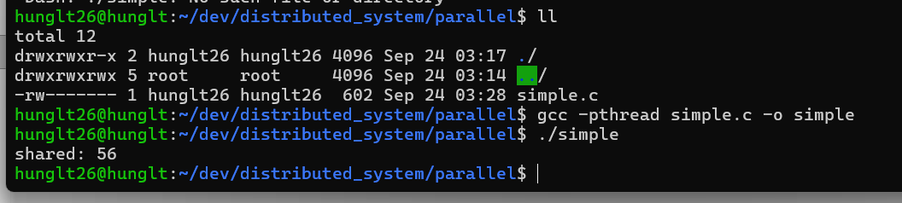

# Chương 4: Đồng bộ hóa

## Câu hỏi 1: Chạy chương trình trên vài lần. Bạn nhận thấy điều gì? Giải thích!

- Kết quả thường nhỏ hơn 3000 và  cho ra giá trị khác nhau.
- Vì có tranh chấp tài nguyên. nhiều thread cùng đọc ghi biến rsc mà không có đồng bộ nên giá trị bị ghi đè.


## Câu hỏi 2: Thay đổi đoạn mã trong chương trình chạy (phương thức main), thay đổi kiểu của 3 thực thể worker1-3 thành ThreadedWorkerWithSync. Bạn nhận thấy sự thay đổi gì ở đầu ra khi chạy chương trình đó khi so sánh với câu hỏi 1? Giải thích!

- Kết quả chạy luôn đúng bằng 3000. 
- Vì Synchronized chỉ cho một thread vào chạy đoạn code bên trong 1 lần. Nên các thread không ghi đề nhau khi truy cập biến chung.


## Câu hỏi 3: Thay đổi đoạn code của chương trình chạy chính bằng cách thay thế kiểu của 3 thực thể worker1-3 thành ThreadedWorkerWithLock. Có khác nhau gì so với đầu ra của câu hỏi 1. Giải thích!

- Kết quả cũng luôn bằng 3000.
- Cơ chế lock cũng đảm bảo chỉ một thread truy cập tài nguyên tại một thời điểm.

  ReentrantLock cho phép:

  - Timeout khi chờ lock.
  - Có thể kiểm soát unlock() thủ công.
  - Có thể dùng tryLock() để tránh deadlock.

  

## Câu hỏi 4: Hoàn thiện file trên (điền vào phần YOUR-CODE-HERE) với một vòng lặp để tăng biến shared lên một đơn vị trong vòng 5 giây. (gợi ý: hàm time(NULL) sẽ trả về giá trị thời gian của hệ thống với đơn vị là giây).

  

## Câu hỏi 5: Bây giờ hãy tăng giá trị số luồng và giá trị của số lần giao dịch NUM_TRANS sau mỗi lần chạy chương trình cho đến khi nào bạn thấy sự khác nhau giữa giá trị Balance (giá trị còn lại trong tài khoản) và INIT_BALANCE+credits-debits. Giải thích tại sao lại có sự khác nhau đó.

  

Nguyên nhân do nhiều luồng cùng lúc đọc biến, tính toán và lưu lại biến Balance gây ra lỗi lost update (mất cập nhật). Khi số luồng và số giao dịch tăng, xác suất lỗi xen kẽ càng cao, dẫn đến sai số tích lũy lớn. Do đó, chương trình không dùng lock sẽ làm dữ liệu bị mất đồng bộ và kết quả sai lệch.

## Câu hỏi 6: Hãy build và chạy chương trình này. Chạy lặp đi lặp lại đến bao giờ bạn thấy sự khác nhau giữa 2 giá trị Shared và Expect. Phân tích mã nguồn để hiểu vấn đề.

```c
        while (lock > 0); //spin until unlocked
        lock = 1; //set lock
        shared++; //increment
        lock = 0; //unlock
```

- Câu lệnh lock = 1 và việc kiểm tra while (lock > 0) không được thực hiện cùng lúc.

- Nhiều luồng có thể cùng vượt qua vòng while, sau đó cùng set lock = 1, dẫn đến nhiều luồng cùng vào vùng găng.

- lock chỉ là một biến thường, việc đọc/ghi không có đảm bảo đồng bộ bộ nhớ.


## Câu hỏi 7: Bây giờ hãy thay đổi đoạn code của file without-lock.c bằng cách triển khai cơ chế mutex lock như trên (bạn có thể tạo file mới và đặt tên khác đi như mutex-lock-banking.c). Chạy chương trình nhiều lần và đánh giá đầu ra. Nó có cải thiện gì hơn so với naive-lock?

- Shared và Expect gần như luôn bằng nhau sau mỗi lần chạy.

Giải thích:

- Naive-lock chỉ là biến thường, không đảm bảo thao tác "kiểm tra + set" được atomic → nhiều luồng vẫn vào vùng găng cùng lúc.

- Mutex lock của thư viện pthread được kernel hỗ trợ, đảm bảo atomicity khi lock/unlock. Chỉ 1 luồng có thể vào vùng găng tại một thời điểm.

  

## Câu hỏi 8: so sánh và đo đạt thời gian để chứng minh là Fine Locking sẽ nhanh hơn Coarse Locking.

  

Với tham số đầu vào là 20000 luồng:
- Kĩ thuật Coarse Locking tốn 0.866s
- Fine Locking tốn 0.085s

=> Fine Locking nhanh gấp 10 lần Coarse Locking.

## Câu hỏi 9: chạy chương trình trên và bạn nhận thấy điều gì? Giải thích thông qua việc phân tích mã nguồn.

- Thường chương trình sẽ treo đứng (không kết thúc) vì cả hai thread bị kẹt.


### Phân tích mã nguồn

Có 2 biến toàn cục:

```c 
int a=0, b=0;
pthread_mutex_t lock_a, lock_b;
```

Có 2 hàm chạy song song ở 2 thread:

```c 
void * fun_1(void * arg) {
    int i;
    for (i = 0; i < 10000; i++) {
        pthread_mutex_lock(&lock_a);   // lock a then b
        pthread_mutex_lock(&lock_b);
        // CRITICAL SECTION
        a++;
        b++;
        pthread_mutex_unlock(&lock_a);
        pthread_mutex_unlock(&lock_b);
    }
    return NULL;
}

void * fun_2(void * arg) {
    int i;
    for (i = 0; i < 10000; i++) {
        pthread_mutex_lock(&lock_b);   // lock b then a
        pthread_mutex_lock(&lock_a);
        // CRITICAL SECTION
        a++;
        b++;
        pthread_mutex_unlock(&lock_b);
        pthread_mutex_unlock(&lock_a);
    }
    return NULL;
}
```
- Thread 1 luôn lấy lock_a trước, sau đó mới đến lock_b.
- Thread 2 luôn lấy lock_b trước, sau đó mới đến lock_a.

Giả sử:

Thread 1 vừa giữ lock_a, chờ thread 2 nhả lock_b.
Thread 2 vừa giữ lock_b, chờ thread 1 nhả lock_a.


  => 2 luồng block nhau sinh ra deadlock.